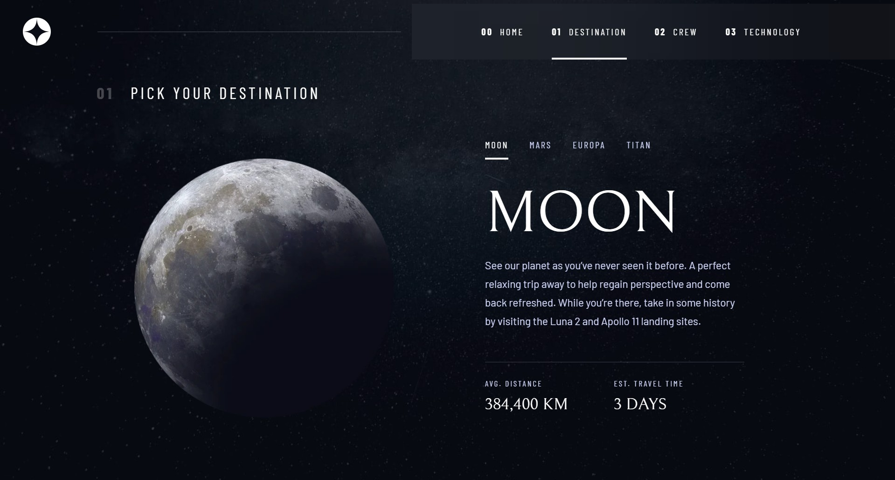

# Frontend Mentor - Space tourism website solution

This is a solution to the [Space tourism website challenge on Frontend Mentor](https://www.frontendmentor.io/challenges/space-tourism-multipage-website-gRWj1URZ3).

## Table of contents

- [Overview](#overview)
  - [The challenge](#the-challenge)
  - [Screenshot](#screenshot)
  - [Links](#links)
- [My process](#my-process)
  - [Built with](#built-with)
  - [What I learned](#what-i-learned)
  - [Continued development](#continued-development)
- [Author](#author)

## Overview

### The challenge

Users should be able to:

- View the optimal layout for each of the website's pages depending on their device's screen size
- See hover states for all interactive elements on the page
- View each page and be able to toggle between the tabs to see new information

### Screenshot

### Links

- Solution URL: [click here](https://github.com/ivan-f-sokolov/space-tourism)
- Live Site URL: [click here](https://ivan-f-sokolov.github.io/space-tourism)

## My process

### Built with

- Mobile-first workflow
- [Vue.js](https://vuejs.org//)
- [Tailwind CSS](https://tailwindcss.com/)

### What I learned

How to use Vue.js in general, so far on options API, Vue Router, Pinia and Tailwind CSS.

### Continued development

I would like to try Nuxt 3, switch to typescript and Vue.js on the composition API

## Author

- GitHub - [Ivan F. Sokolov](https://github.com/ivan-f-sokolov)
